# 🌐 Blue-GEO (`@geo`)

🌐 AI for a Blue Planet.

```bash
pip install blue-geo
```

```mermaid
graph LR
    catalog_browse["@catalog<br>browse<br>&lt;catalog-name&gt;<br>&lt;resource&gt;"]

    catalog_get["@catalog<br>get &lt;thing&gt;<br>--catalog &lt;catalog&gt;"]

    catalog_list_catalogs["@catalog<br>list catalogs"]

    catalog_list["@catalog<br>list collections|datacube_classes<br>--catalog &lt;catalog&gt;"]

    catalog_query["@catalog<br>query<br>&lt;catalog-name&gt;<br>&lt;collection-name&gt; -<br>&lt;query-object-name&gt;"]

    catalog_query_and_ingest["@catalog<br>query<br>&lt;catalog-name&gt;<br>&lt;collection-name&gt;<br>ingest,scope=&lt;scope&gt;<br>&lt;query-object-name&gt;"]

    catalog_query_read["@catalog<br>query<br>read -<br>&lt;query-object-name&gt;"]

    catalog_query_ingest["@catalog<br>query<br>ingest -<br>&lt;query-object-name&gt;<br>scope=&lt;scope&gt;"]

    datacube_crop["@datacube<br>crop -<br>&lt;object-name&gt;<br>&lt;datacube-id&gt;"]

    datacube_get["@datacube<br>get<br>catalog<br>&lt;datacube-id&gt;"]

    datacube_ingest["@datacube<br>ingest<br>scope=&lt;scope&gt;<br>&lt;datacube-id&gt;"]

    datacube_label["@datacube<br>label -<br>&lt;datacube-id&gt;"]

    datacube_list["@datacube<br>list<br>&lt;datacube-id&gt;<br>--scope &lt;scope&gt;"]

    geo_watch["@geo watch<br>batch<br>&lt;query-object-name&gt;|target=&lt;target&gt; -<br>to=&lt;runner&gt; - -<br>&lt;object-name&gt;"]

    catalog["🌐 catalog"]:::folder
    datacube_1["🧊 datacube"]:::folder
    datacube_2["🧊 datacube"]:::folder
    datacube_3["🧊 datacube"]:::folder
    terminal["💻 terminal"]:::folder
    QGIS["🖼️ QGIS"]:::folder
    query_object["📂 query object"]:::folder
    object["📂 object"]:::folder
    target["🎯 target"]:::folder

    catalog_list_catalogs --> terminal

    catalog --> catalog_browse
    catalog_browse --> terminal

    catalog --> catalog_get
    catalog_get --> terminal

    catalog --> catalog_list
    catalog_list --> terminal

    catalog --> catalog_query
    catalog_query --> query_object

    catalog --> catalog_query_and_ingest
    catalog_query_and_ingest --> query_object
    catalog_query_and_ingest --> datacube_1

    query_object --> catalog_query_read
    catalog_query_read --> datacube_1

    query_object --> catalog_query_ingest
    catalog_query_ingest --> datacube_1
    catalog_query_ingest --> datacube_2
    catalog_query_ingest --> datacube_3

    datacube_1 --> datacube_crop
    target --> datacube_crop
    datacube_crop --> datacube_1

    datacube_1 --> datacube_get
    datacube_get --> terminal

    datacube_1 --> datacube_ingest
    datacube_ingest --> datacube_1

    datacube_1 --> datacube_list
    datacube_list --> terminal

    datacube_1 --> datacube_label
    datacube_label --> QGIS
    datacube_label --> datacube_1

    query_object --> geo_watch
    target --> geo_watch
    geo_watch --> object

    classDef folder fill:#999,stroke:#333,stroke-width:2px;
```



|   |   |   |
| --- | --- | --- |
| 🧊[`Maxar Open Data`](https://github.com/kamangir/blue-geo/tree/main/blue_geo/catalog/maxar_open_data) [](https://github.com/kamangir/blue-geo/tree/main/blue_geo/catalog/maxar_open_data) catalog: [Maxar's Open Data program](https://www.maxar.com/open-data/) | 🧊[`copernicus`](https://github.com/kamangir/blue-geo/tree/main/blue_geo/catalog/copernicus) [](https://github.com/kamangir/blue-geo/tree/main/blue_geo/catalog/copernicus) catalog: [Copernicus Data Space Ecosystem - Europe's eyes on Earth](https://dataspace.copernicus.eu/) | 🌐[`SkyFox`](https://github.com/kamangir/blue-geo/tree/main/blue_geo/catalog/SkyFox) [](https://github.com/kamangir/blue-geo/tree/main/blue_geo/catalog/SkyFox) catalog: [Earth Data Store](https://earthdaily.github.io/EDA-Documentation/). |
| 🌐[`EarthSearch`](https://github.com/kamangir/blue-geo/blob/main/blue_geo/catalog/EarthSearch) [](https://github.com/kamangir/blue-geo/blob/main/blue_geo/catalog/EarthSearch) catalog: [Earth Search by Element 84 (earth-search-aws)](https://stacindex.org/catalogs/earth-search#/). | 🌐[`firms-area`](https://github.com/kamangir/blue-geo/tree/main/blue_geo/catalog/firms) [](https://github.com/kamangir/blue-geo/tree/main/blue_geo/catalog/firms) catalog: Fire Information for Resource Management System ([FIRMS](https://firms.modaps.eosdis.nasa.gov)). | 🇺🇦[`ukraine-timemap`](https://github.com/kamangir/blue-geo/blob/main/blue_geo/catalog/ukraine_timemap) [](https://github.com/kamangir/blue-geo/blob/main/blue_geo/catalog/ukraine_timemap) catalog: [Bellingcat](https://www.bellingcat.com/) [Civilian Harm in Ukraine TimeMap](https://github.com/bellingcat/ukraine-timemap) dataset, available through [this UI](https://ukraine.bellingcat.com/) and [this API](https://bellingcat-embeds.ams3.cdn.digitaloceanspaces.com/production/ukr/timemap/api.json). |
| 🌈[`vancouver-watching`](https://github.com/kamangir/Vancouver-Watching) [](https://github.com/kamangir/Vancouver-Watching) catalog: Vancouver watching with AI, last build: [🔗](https://kamangir-public.s3.ca-central-1.amazonaws.com/test_vancouver_watching_ingest/animation.gif). | 🌐[`geo-watch`](https://github.com/kamangir/blue-geo/blob/main/blue_geo/watch) [](https://github.com/kamangir/blue-geo/blob/main/blue_geo/watch) watch the planet's story unfold. | 🌐[`global-power-plant-database`](https://github.com/kamangir/blue-geo/tree/main/blue_geo/objects/md/global_power_plant_database.md) [](https://github.com/kamangir/blue-geo/tree/main/blue_geo/objects/md/global_power_plant_database.md) The Global Power Plant Database is a comprehensive, open source database of power plants around the world [datasets.wri.org](https://datasets.wri.org/datasets/global-power-plant-database). |
| 🌐[`QGIS`](https://github.com/kamangir/blue-geo/blob/main/blue_geo/QGIS/README.md) [](https://github.com/kamangir/blue-geo/blob/main/blue_geo/QGIS/README.md) an AI terraform for [QGIS](https://www.qgis.org/). | 🌐[`catalog`](https://github.com/kamangir/blue-geo/tree/main/blue_geo/catalog) [](https://github.com/kamangir/blue-geo/tree/main/blue_geo/catalog) generalized STAC Catalogs. | 🧊[`datacube`](https://github.com/kamangir/blue-geo/tree/main/blue_geo/datacube) [](https://github.com/kamangir/blue-geo/tree/main/blue_geo/datacube) generalized STAC Items. |

---

📜 [metadata](./metadata.yaml)

🎁 [wish list and bugs](https://github.com/kamangir/blue-geo/issues/8)


[](https://github.com/kamangir/blue-geo/actions/workflows/pylint.yml) [](https://github.com/kamangir/blue-geo/actions/workflows/pytest.yml) [](https://github.com/kamangir/blue-geo/actions/workflows/bashtest.yml) [](https://pypi.org/project/blue-geo/) [](https://pypistats.org/packages/blue-geo)

built by 🌀 [`blue_options-4.200.1`](https://github.com/kamangir/awesome-bash-cli), based on 🌐 [`blue_geo-4.1058.1`](https://github.com/kamangir/blue-geo).
