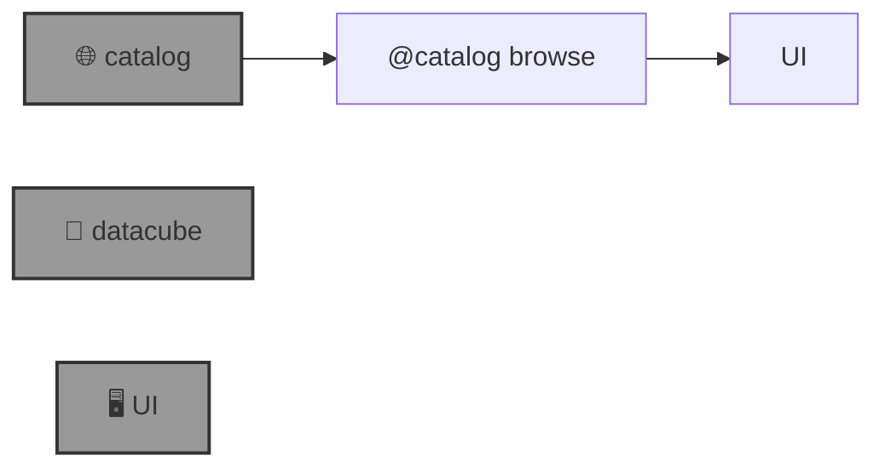

# 🌐 Blue-GEO (`@geo`)

🌐 AI for a Blue Planet.

```bash
pip install blue-geo
```



--table--

---

📜 [metadata](./metadata.yaml)

🎁 [wish list and bugs](https://github.com/kamangir/blue-geo/issues/8)

--signature--