# 🌐 Blue-GEO (`@geo`)

🌐 AI for a Blue Planet.

```bash
pip install blue-geo
```

```mermaid
graph LR
    catalog_browse["@catalog browse <catalog-name> <resource>"]
    catalog_get["@catalog get~<thing> --catalog~<catalog>"]
    catalog_list_catalogs["@catalog list catalogs"]
    catalog_list["@catalog list collections|datacube_classes --catalog~<catalog>"]
    catalog_query["@catalog query <catalog-name> <collection-name> scope=<scope> <query-object-name>"]
    catalog_query_read["@catalog query read~- <query-object-name>"]

    catalog["🌐 catalog"]:::folder
    datacube_id["🧊 datacube"]:::folder
    UI["🖥️ UI"]:::folder
    query_object["query object"]:::folder

    catalog --> catalog_browse
    catalog_browse --> UI

    catalog --> catalog_get
    catalog_get --> UI

    catalog_list_catalogs --> UI

    catalog --> catalog_list
    catalog_list --> UI

    catalog --> catalog_query
    catalog_query --> query_object

    query_object --> catalog_query_read

    classDef folder fill:#999,stroke:#333,stroke-width:2px;
```



--table--

---

📜 [metadata](./metadata.yaml)

🎁 [wish list and bugs](https://github.com/kamangir/blue-geo/issues/8)

--signature--